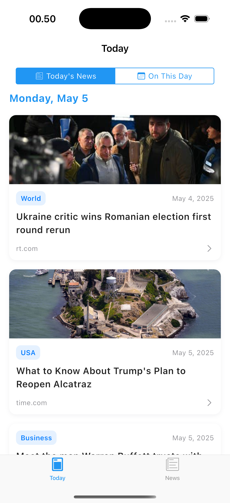
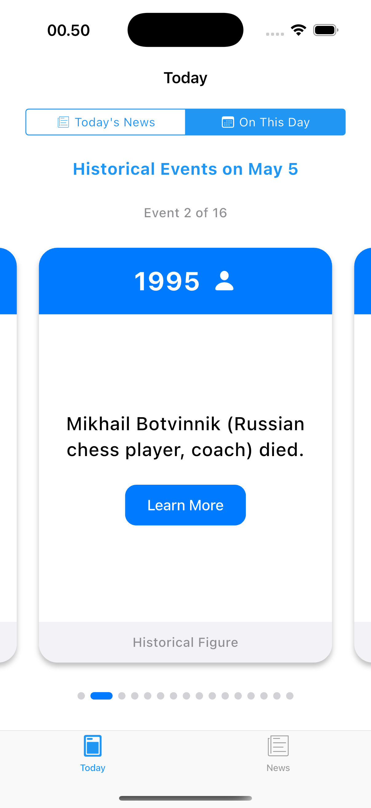
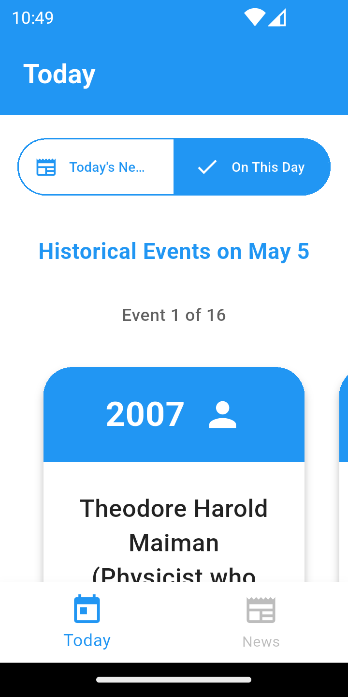
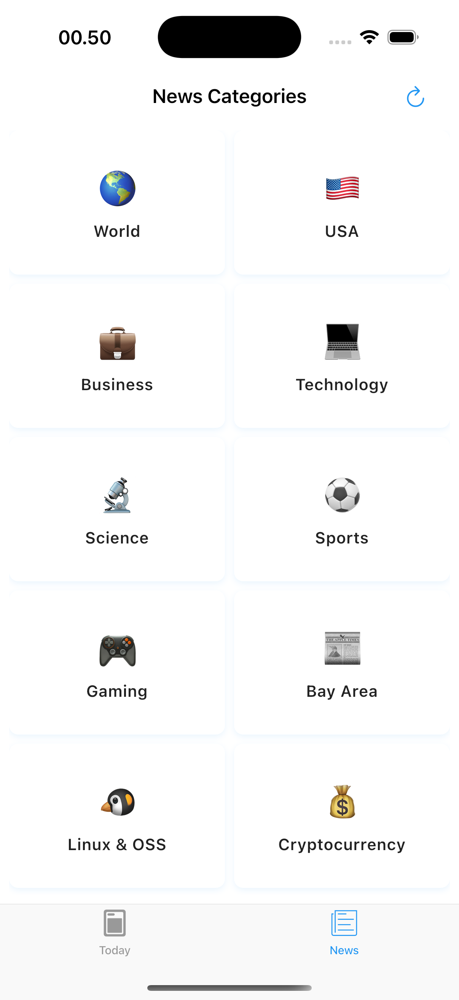
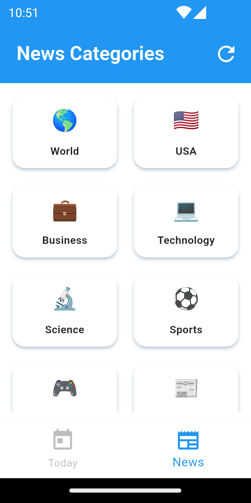
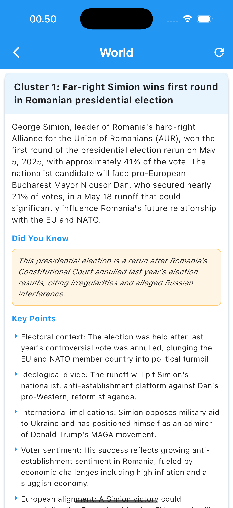
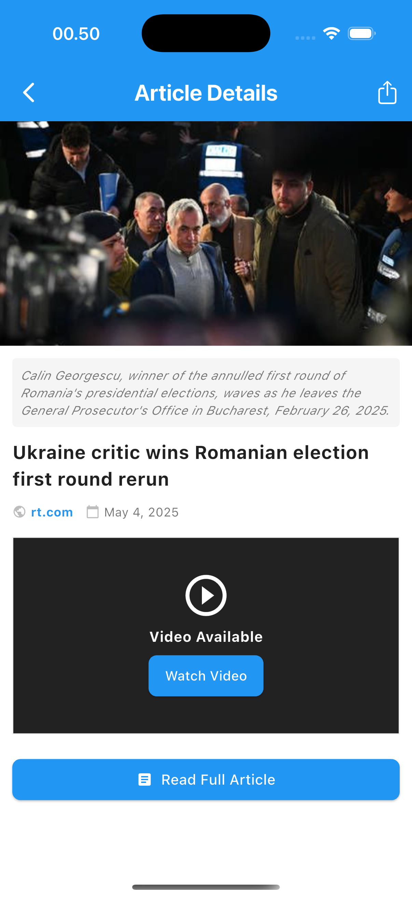

# aNewsment

aNewsment is a news aggregation mobile app built with Flutter that displays categorized news articles, historical events, and more. The app follows the MVC architecture pattern with GetX for state management.

## Features

- Tabbed interface with Today and News sections
- Grid view of news categories with custom emoji icons
- Article clustering for related news stories
- Historical "On This Day" events
- Video support for articles (YouTube, Vimeo, Dailymotion)
- Share functionality with platform-specific icons
- Responsive design for various screen sizes

## Screenshots

### Today's News
<p float="left">
  
  
</p>

### On This Day
<p float="left">
  
  
</p>

### News Categories
<p float="left">
  
  
</p>

### Article Clusters
<p float="left">
  
  
</p>

### Article Details
<p float="left">
  
  
</p>

## Project Structure

The app follows MVC design pattern,

lib/controllers/ (for business logic and state management)  
lib/models/ (for data models)  
lib/services/ (for API integrations)   
lib/views/ (for UI views)  
lib/components/ (for reusable UI components)  
lib/utils/ (for helper functions and utilities)  
lib/routes/ (for app navigation between screens)  
lib/main.dart (app entry point)  

## Setup & Installation

### Prerequisites

- Flutter SDK (latest version)
- Dart SDK (latest version)
- Android Studio and/ Xcode for device emulators
- IDE: VSCode/Android Studio

### Installation

1. Clone the repository
   ```
   git clone https://github.com/jaysonkaynneth/anewsment.git
   cd anewsment
   ```

2. Install dependencies
   ```
   flutter pub get
   ```

3. Run the app
   ```
   flutter run
   ```

## Testing

### Running Tests

You can run unit tests using these script:

```
flutter test
```

```
# to make the script executable
chmod +x test.sh

# all tests
./test.sh

# service tests
./test.sh services

# utility tests
./test.sh utils

# widget tests
./test.sh widgets
```
